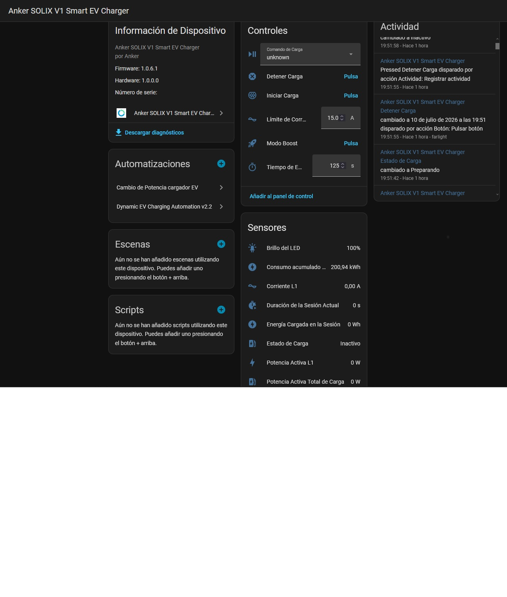

# Anker Solix V1 Smart EV Charger Integration for Home Assistant

Home Assistant integration for [Anker Solix V1 Smart EV Charger](https://www.ankersolix.com/eu/smart-ev-charger-v1) devices.

This integration connects to your V1 Smart EV Chrger devices **locally** via Modbus TCP on your home network. All communication stays on your LAN — no cloud servers, no API keys, no internet dependency.
This integration is a fork of the official [Anker Solix Official Integration for Home Assistant](https://github.com/anker-charging/ha-anker-solix-official), but highly modified to support MODBUS TCP on the charger

## Features

- **Local Modbus TCP** — Direct communication over LAN, no cloud dependency, no internet required
- **Real-time monitoring** — Live device status, power metrics, and diagnostics updated every 5 seconds
- **Device control** — Operating mode switching, boost mode, and output power control via Home Assistant UI

## Preview

## Supported Devices

- Anker SOLIX V1 Smart EV Charger

## Prerequisites: Enable Modbus TCP in Anker App

Before setting up this integration, you must enable Modbus TCP on your device through the Anker App.

**Step 1:** Open the Anker App and go to the **Devices** tab. Select your device.

**Step 2:** Tap the **Settings** icon (gear icon in the top right corner) to enter the device settings page.

**Step 3:** Tap **Three‑Party Control Settings**.

**Step 4:** Enable the **Modbus TCP** toggle. Note down the **IP address** displayed — you will need it when adding the integration in Home Assistant.

## Installation

### HACS (Recommended)

1. Open **HACS** in Home Assistant
2. Go to **Custom Repositories** and add repository: "https://github.com/farlight1/HA-anker-solix-v1-EV-unofficial" Type: Integration
2. Go to **Integrations** and click **+**
3. Search for **Anker SOLIX V1 Smart EV Charger**
4. Click **Install** and restart Home Assistant

### Manual

1. Download the [latest release](https://github.com/farlight1/HA-anker-solix-v1-EV-unofficial/releases)
2. Copy `custom_components/ha-anker-solix-unofficial/` into your Home Assistant `config/custom_components/` directory
3. Restart Home Assistant

## Setup

1. Go to **Settings** > **Devices & Services**
2. Click **Add Integration**
3. Search for **Anker Solix V1 Smart EV Charger**
4. Enter your device's local IP address (Modbus TCP port 502 is used by default)
5. The integration auto-detects the device model and loads the matching configuration

## FAQ

**What network port does this use?**
Modbus TCP on port 502 (standard Modbus port).

**How often does data refresh?**
Every 5 seconds via local polling.

**Can't connect to my device?**
Check that: the device is powered on and on the same network, the IP address is correct, Modbus TCP is enabled on the device, and no firewall is blocking port 502.

**The Communication Settings option is greyed out and cannot be tapped?**
Possible reasons:
The device is currently offline — wait for the device to come back online

**Will Home Assistant control conflict with Anker App control?**
- When "Third-Party Controlled" mode is enabled, the device will execute commands from Home Assistant
- When "Third-Party Controlled" mode is disabled, the device will follow the mode set in the Anker App
- It is recommended to clearly define your control method to avoid frequent switching

**Can I control multiple devices?**
Yes. You can add multiple Anker chargers in Home Assistant, each configured and controlled independently.

**Can I use the Anker App and Home Assistant at the same time?**
- Yes, both can be used simultaneously, but be aware of control priority
- When "Third-Party Controlled" mode is enabled, Home Assistant commands take higher priority
- Recommended division of responsibilities:
  - **Anker App**: Device configuration, firmware updates, detailed statistics
  - **Home Assistant**: Daily automation, control, and monitoring
- Avoid modifying the same parameter on both platforms simultaneously, as this may cause conflicts

## Data Security

- **Local communication** — All device control and data reading are performed over local LAN connections. No dependency on cloud servers. Data is transmitted directly between your local Home Assistant instance and the device.
- **Standard protocol** — Uses the Modbus TCP standard protocol for communication.
- **Access control** — Modbus access can be enabled or disabled at any time through the Communication Settings toggle in the Anker App. When disabled, no external platform can access the device via Modbus.

## Troubleshooting

### Connection Issues

**Cannot discover the device:**
- Confirm the device and Home Assistant are on the same LAN
- Confirm the Modbus TCP toggle is enabled in the Anker App
- Verify the device IP address is correct (it may have changed)
- Try pinging the device IP to test network connectivity
- Check if the router firewall is blocking port 502

**Connection drops frequently:**
- Check if the device's Wi-Fi connection is stable
- Confirm the router is working properly
- Set a static IP or DHCP reservation for the device
- Check if the Wi-Fi signal strength is sufficient
- Confirm the device firmware is up to date

### Data Issues

**Sensor data not updating:**
- Check if the network connection is normal
- Confirm the Modbus TCP toggle is enabled in the Anker App
- Restart the Home Assistant integration
- Check the Home Assistant logs for communication errors

## License

MIT License — see [LICENSE](LICENSE) for details.
